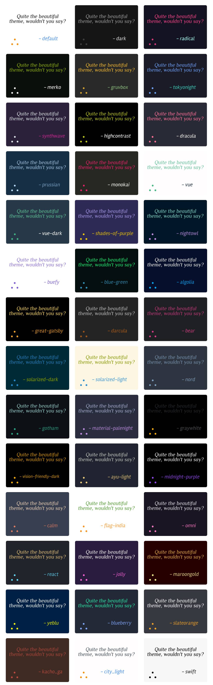

<p align="center">
  
</p>

<p align="center">
  
</p>


<p align="center">
  <a href="https://skillicons.dev">
    
  </a>
</p>


## Overview
The philosophical quotes generator is an API that allows you to add a philosophical quote image to your GitHub README. It is important to note that
just because a quote is included in the generator, doesn't necessarily mean that I agree wholeheartedly with the position the philosopher is taking.
In fact, many of the quotes here are contradictory and take positions against other quoted philosophers. The purpose of philosophy is to work together 
to try and find the truth, those who disagree with you are not your enemy, but rather your ally.

<p align="center">
  
</p>

## Usage
The server that hosts this API is on DigitalOcean, and you can access it by using the following URL:

```markdown
http://147.182.254.93:8080/generate_image?timestamp=<current_timestamp>
```

You can use the query parameters in the next section to customize the quote image that is generated

The only thing I request is to star this repository, and add the following comment to your README:

```markdown
<!-- Generated by the Philosophical Quotes API https://github.com/markstanl/Philosophical-Quotes-API/blob/main/README.md -->
```

## Query Parameters

 | Parameter    | Description                                                                                                                                                              |
|--------------|--------------------------------------------------------------------------------------------------------------------------------------------------------------------------|
| `author`     | This parameter allows you to filter the quotes by the name of the philosopher who said the quote. It is case-insensitive.                                                |
| `theme`      | This parameter allows you to filter the quotes by the theme, i.e., the color scheme. It is case-insensitive.                                                             |
| `daily_quote`| If you would rather only have the quote generated daily, you can use this parameter. It will only generate a new quote once per day. Any value makes this work            |
| `quote`      | This parameter allows you to generate a specific quote. Simply put in the quote you would like to generate. It is case-insensitive and must start with a quotation mark. |
| `quote_index`| This parameter allows you to generate a specific quote by index. Simply put the index number of the quote in the quotes.py file.                                      |
| `exclude_indexes`| This parameter allows you to restrict certain ID values from the generation                                                                                              |
| `timestamp`  | This parameter is used to generate a unique quote based on the current timestamp, only put <current_timestamp> as a value                                                |

### Author
You can filter by the name of the philosopher who said the quote. The author parameter is case-insensitive. Here is a list of the authors you can filter by:

| Authors             | Authors               | Authors             |
|---------------------|-----------------------|---------------------|
| Albert Camus        | Aristotle             | Bertrand Russell    |
| Daniel Quinn        | David Hume            | Friedrich Nietzsche |
| Immanuel Kant       | Jean-Jacques Rousseau | John Rawls          |
| Ludwig Wittgenstein | Martin Heidegger      | Peter Singer        |
| Plato               | René Descartes        | Richard Dawkins     |
| Socrates            |                       |                     |

### Theme
You can filter by the theme of the quote, i.e., the color scheme. The theme parameter is case-insensitive. Here is a list of the themes you can filter by:
These themes are based on gprm's GitHub readme stats themes. You can find the project [here](https://gprm.itsvg.in/).

| Theme Names | Theme Names | Theme Names |
|-------------|-------------|-------------|
| default | dark | radical |
| merko | gruvbox | tokyonight |
| synthwave | highcontrast | dracula |
| prussian | monokai | vue |
| vue-dark | shades-of-purple | nightowl |
| buefy | blue-green | algolia |
| great-gatsby | darcula | bear |
| solarized-dark | solarized-light | chartreuse-dark |
| nord | gotham | material-palenight |
| graywhite | vision-friendly-dark | ayu-light |
| midnight-purple | calm | flag-india |
| omni | react | jolly |
| maroongold | yeblu | blueberry |
| slateorange | kacho_ga | city_light |
| swift | | |

<p align="center">
  
</p>

### Daily Quote
If you would rather only have the quote generated daily, you can use the daily_quote parameter. 
This will only generate a new quote once per day. The daily_quote parameter is boolean, any value works for an input

### Specific Quote
If you would like to generate a specific quote, you can use the quote parameter. Simply put in the quote
you would like to generate. The quote parameter is case-insensitive and will find a match if you type in the start of 
the quote, and it is unique, but _must_ start with a quotation mark.

| Request                                            | Status             | Description                                                                                                                                                    |
|----------------------------------------------------|--------------------|----------------------------------------------------------------------------------------------------------------------------------------------------------------|
| `/generate_image?quote="I think, therefore I am."` | :heavy_check_mark: | This is the most clear and will be successful                                                                                                                  |
| `/generate_image?quote="I think, therefore I am`   | :heavy_check_mark: | This will also be successful, as it completes the quote as long as the start is unique                                                                         |
| `/generate_image?quote="I think`                   | :warning:          | This will likely not be successful, as it is not unique enough. Though it may be successful, future updates may provide other quotes that start with "I think" |
| `/generate_image?quote=I think, therefore I am.`   | :x:                | This will not be successful, as it does not start with a quotation mark                                                                                        |
### Specific Quote Index
If you would like to generate a specific quote by index, you can use the quote_index parameter. Simply put the id value of the quote as seen in the
quotes.db sql database file. 

### Exclude Indexes
If you would like to exclude certain indexes from the generation, you can use the exclude_indexes parameter. This will exclude the indexes you provide from the generation.
To use this, find the id values of the quotes you wish to exclude, and put them in a comma-separated list.

| Request                                         | Status             | Description                                                                                                                                       |
|-------------------------------------------------|--------------------|---------------------------------------------------------------------------------------------------------------------------------------------------|
| `/generate_image?exclude_indexes=1,2,3`         | :heavy_check_mark: | This will exclude the first three quotes from the generation                                                                                      |
| `/generate_image?exclude_indexes=1`             | :heavy_check_mark: | This will exclude the first quote from the generation                                                                                             |
| `/generate_image?exclude_indexes=1,18, 6`       | :heavy_check_mark: | This will exclude the first, sixth, and eighth quotes from the generation                                                                         |
| `/generate_image?exclude_indexes=1, 18, 6`      | :warning:          | This will exclude the first nine quotes from the generation, but the spaces after the commas are not necessary and may cause issues               |
| `/generate_image?exclude_indexes=1, 1 1, 10000` | :x:                | This will not be successful, the second value is not a number, and there is not a quote with id value 10000                                       |


### Timestamp
To gain a unique quote for every README reload, you can use the timestamp parameter. This will generate a unique quote based on the current timestamp, which changes every minute.


